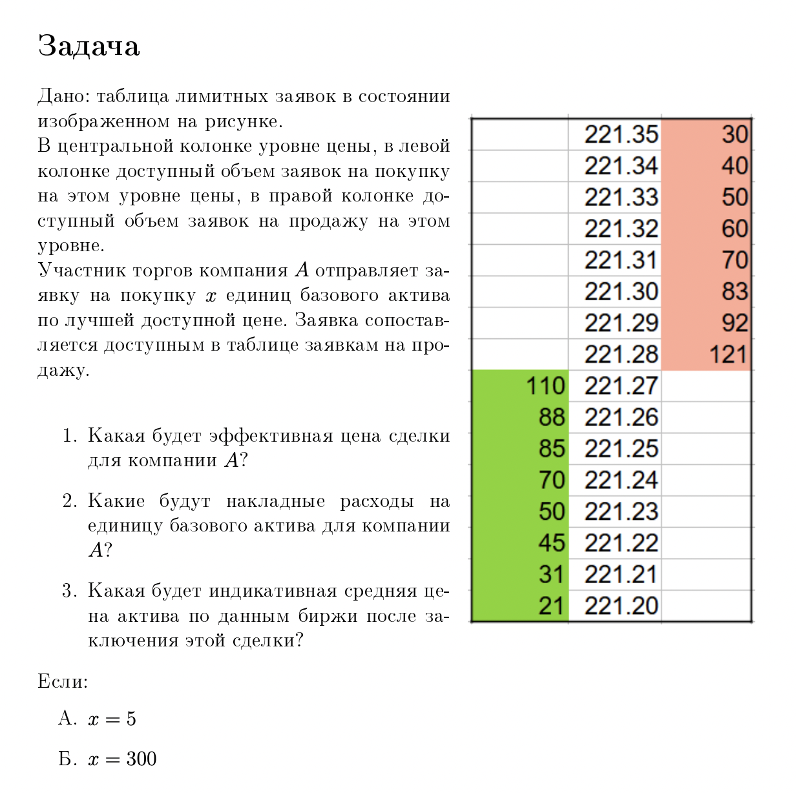

## Solution - Task 0
Author: Никитин Никита

$I.\ \ x = 5$
1. Будет куплено 5 единиц базового товара по цене 221.28. Эффективная цена сделки - 221.28.
2. mid-price до покупки: $\frac{221.28 + 221.27}{2} = 221.275$
Накладные расходы на единицу базового актива: $(221.28 - 221.275) = 0.005$
3. mid-price после покупки: $\frac{221.28 + 221.27}{2} = 221.275$

$II.\ \ x = 300$
1. Будет куплено:
- 121 единица базового товара по цене 221.28.
- 92 единица базового товара по цене 221.29.
- 83 единица базового товара по цене 221.30.
- 4 единица базового товара по цене 221.31.\
Эффективная цена сделки: $\frac{121 * 221.28 + 92 * 221.29 + 83 * 221.30 + 4 * 221.31}{300} = 221.289$
2. mid-price до покупки: $\frac{221.28 + 221.27}{2} = 221.275$
Накладные расходы на единицу базового актива: $(221.289 - 221.275) = 0.014$
3. mid-price после покупки: $\frac{221.31 + 221.27}{2} = 221.29$

